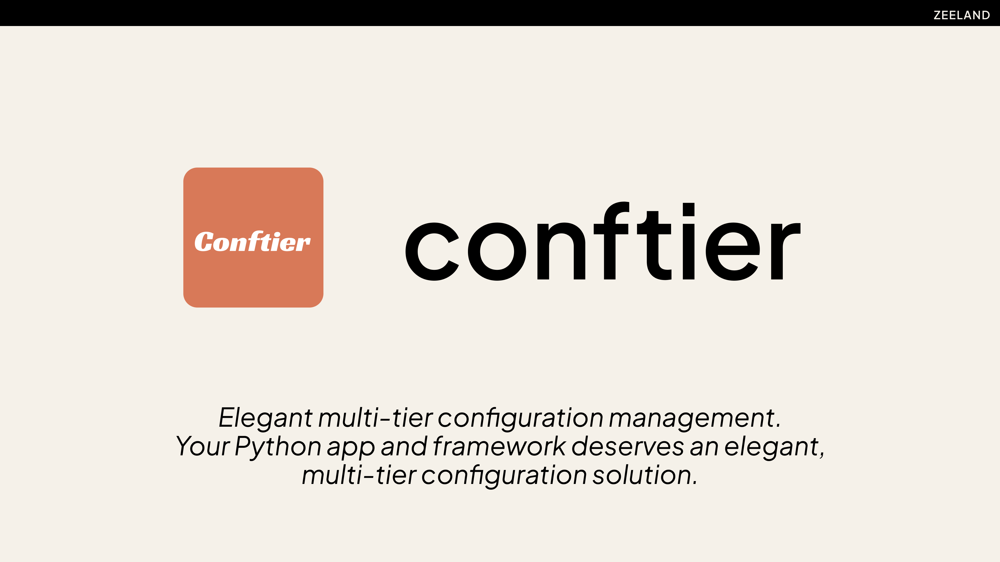
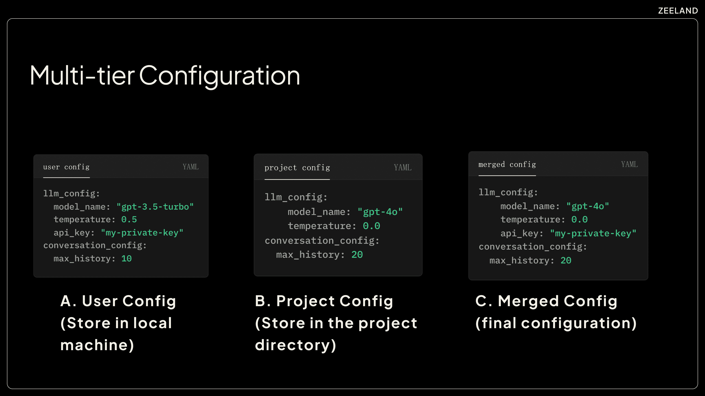

<p align="center">
   
</p>

<div align="center">

[](https://github.com/Undertone0809/conftier/actions?query=workflow%3A%22Rust+CI%22)
[](https://github.com/Undertone0809/conftier/actions?query=workflow%3Abuild)
[](https://pypi.org/project/conftier/)
[](https://github.com/astral-sh/ruff)
[](https://github.com/Undertone0809/conftier/blob/main/LICENSE)


</div>

# Conftier

A powerful multi-tier configuration management framework that simplifies the definition, access, and synchronization of layered configurations in applications.

Think of VSCode's configuration system: you have user settings that apply globally and workspace settings that override them for specific projects. Conftier brings this same intuitive model to your frameworks and applications.

## Available Implementations

Conftier is available in multiple languages:

- **Python**: Full-featured implementation with Pydantic and dataclass support
- **Rust**: High-performance implementation with serde integration (NEW!)

## Documentation

For comprehensive guides, examples, and API reference, visit our documentation:

- [Introduction](https://conftier.zeeland.top/)
- [Quick Start Guide](https://conftier.zeeland.top/guide/quick-start.html)
- [Contributing](https://conftier.zeeland.top/other/contributing.html)

## Overview

Conftier helps you manage configurations across multiple levels:

- **User-level settings**: Global preferences that apply across all projects (~/.zeeland/{config_name}/config.yaml)
- **Project-level settings**: Local configurations specific to a project (./.{config_name}/config.yaml)
- **Default values**: Fallback values defined in your configuration schema

Conftier automatically merges these configurations based on priority (project > user > default).

<p align="center">
   
</p>

## Key Features

- **Multi-level Configuration Management**: Like VSCode's user/workspace settings pattern
- **Flexible Schema Definition**: Use Pydantic models, dataclasses (Python) or serde structs (Rust)
- **Type Safety**: No more string/int confusion or missing required fields
- **Smart Merging**: Only override what's specified, preserving other values
- **CLI Integration**: Built-in command-line tools for configuration management
- **Cross-language Compatibility**: Same configuration model in different languages

## Installation

### Python

```bash
# Basic installation
pip install conftier

# With Pydantic support (recommended)
pip install conftier[pydantic]
```

### Rust

Add this to your Cargo.toml:

```toml
[dependencies]
conftier = ">=0.0.2"
```


## Quick Start

### Python Example

1. **Install**

```bash
pip install conftier[pydantic]  # recommended with pydantic support
```

2. **Define your configuration model**

```python
from pydantic import BaseModel
from conftier import ConfigManager

# Define your config model
class AppConfig(BaseModel):
    app_name: str = "MyApp"  # default value
    debug: bool = False
    max_connections: int = 10
```

3. **Create a config manager and use it**

```python
# Create config manager
config_manager = ConfigManager(
    config_name="myapp",  # config name, will be used for filenames
    config_schema=AppConfig,  # your config model
    auto_create=True  # automatically create config files
)

# Load the merged configuration
config = config_manager.load()
print(f"App name: {config.app_name}")
print(f"Debug mode: {config.debug}")
```

4. **Check your generated config files**

- Global config: `~/.zeeland/myapp/config.yaml`
- Project config: `./.myapp/config.yaml`

5. **Example YAML file contents**

Global config (`~/.zeeland/myapp/config.yaml`):

```yaml
# Global settings for all projects
app_name: MyGlobalApp
debug: false
max_connections: 20
```

Project config (`./.myapp/config.yaml`):

```yaml
# Project-specific settings
app_name: MyProjectApp
debug: true
# max_connections inherits from global (20)
```

Final merged config:

```python
# Priority: Project > Global > Default
config.app_name  # "MyProjectApp" (from project)
config.debug  # True (from project)
config.max_connections  # 20 (from global)
```

### Rust Example

1. **Add dependencies**

```toml
[dependencies]
conftier = ">=0.0.2"
serde = { version = "1.0", features = ["derive"] }
```

2. **Define your config struct and use it**

```rust
use serde::{Serialize, Deserialize};
use conftier::core::ConfigManager;

// Define your config struct
#[derive(Serialize, Deserialize, Clone, Default)]
struct AppConfig {
    app_name: String,
    debug: bool,
}

fn main() -> Result<(), Box<dyn std::error::Error>> {
    // Initialize config manager
    let mut config_manager = ConfigManager::<AppConfig>::new(
        "myapp", "1.0", true, true
    );
    
    // Load configuration
    let config = config_manager.load();
    println!("App name: {}", config.app_name);
    
    Ok(())
}
```

3. **Example YAML file contents**

Global config (`~/.zeeland/myapp/config.yaml`):

```yaml
# Global settings for all projects
app_name: "RustGlobalApp"
debug: false
```

Project config (`./.myapp/config.yaml`):

```yaml
# Project-specific settings
app_name: "RustProjectApp"
debug: true
```

Final merged config:

```rust
// Priority: Project > Global > Default
config.app_name  // "RustProjectApp" (from project)
config.debug     // true (from project)
```

## Key Features

- **Type Safety**: No more string/int confusion or missing required fields
- **Smart Merging**: Only override what's specified, preserving other values
- **CLI Tools**: Built-in command-line tools for configuration management
- **Cross-language Compatibility**: Same configuration model in different languages

## When to Use Conftier

Conftier is perfect for:

1. **Building frameworks or libraries**: Give your users a consistent way to configure your tool
2. **Apps with both user and project settings**: Like VSCode's personal vs. project-specific settings
3. **Need for schema validation**: Ensure configuration values have the correct types and valid ranges
4. **Reducing boilerplate**: Stop writing the same configuration loading code in every project

## Documentation

- [Full Documentation](https://conftier.zeeland.top/)
- [Quick Start Guide](https://conftier.zeeland.top/guide/quick-start.html)
- [Contributing Guide](https://conftier.zeeland.top/other/contributing.html)

## 🛡 License

[](https://github.com/Undertone0809/conftier/blob/main/LICENSE)

This project is licensed under the terms of the `MIT` license.
See [LICENSE](https://github.com/Undertone0809/conftier/blob/main/LICENSE) for more details.

## 🤝 Support

For more information, please contact: [zeeland4work@gmail.com](mailto:zeeland4work@gmail.com)

## Credits [](https://github.com/Undertone0809/python-package-template)

This project was generated with [P3G](https://github.com/Undertone0809/P3G)
