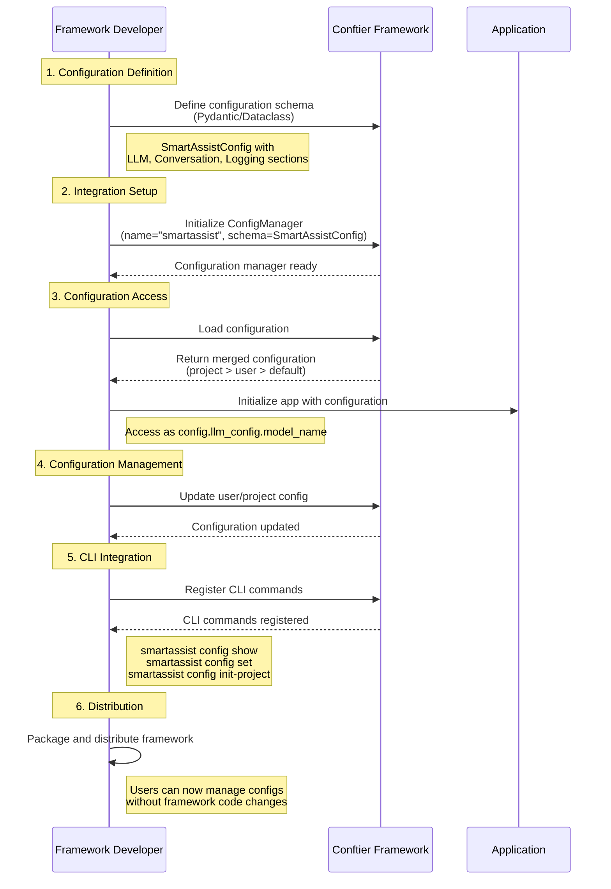
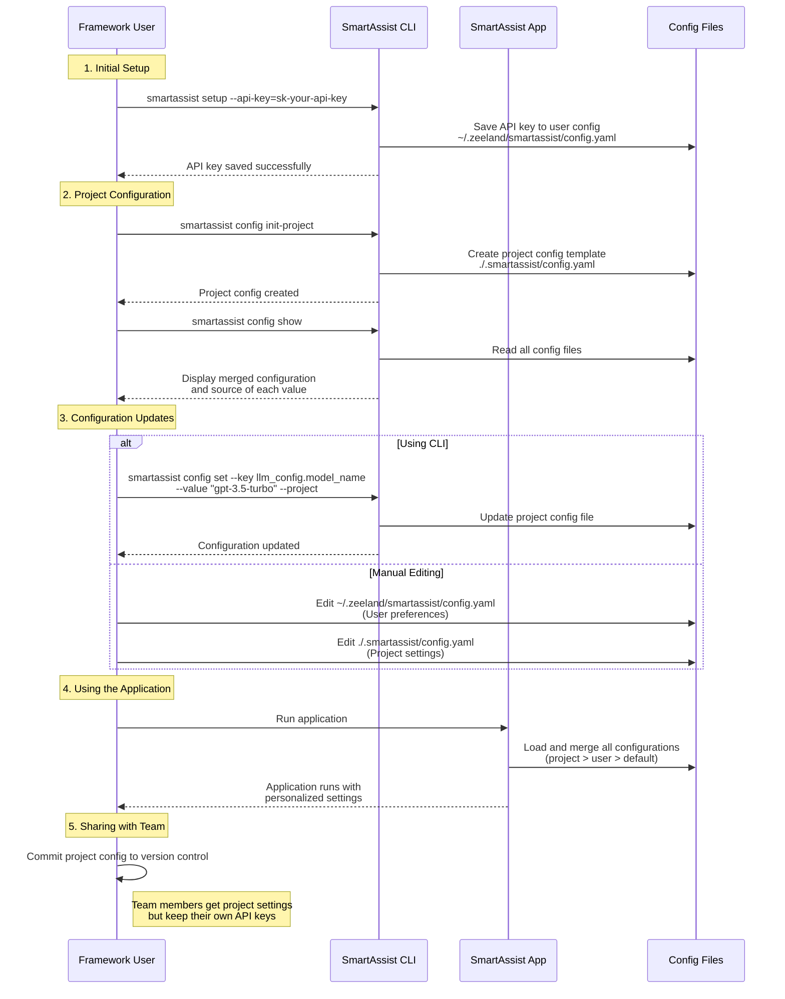

# Getting Started

In this comprehensive guide, we'll embark on a step-by-step journey to create a complete configuration system for an AI assistant framework called "SmartAssist" using conftier. From scratch to a fully functional configuration system, we'll cover every detail to ensure a seamless integration of conftier into your project.

## Installation

You can install conftier using pip:

```bash
pip install conftier
```

### With Pydantic Support (Recommended)

Conftier recommends using Pydantic for defining configuration schemas as it provides robust validation, serialization, and documentation features.

```bash
# With Pydantic support
pip install conftier[pydantic]
```

### Using Poetry

```bash
# Basic installation
poetry add conftier

# With Pydantic support
poetry add conftier[pydantic]
```

## Building Our Example: SmartAssist Framework

Throughout this guide, we'll use a consistent example of an AI assistant framework called "SmartAssist" that needs to manage:

- LLM API configurations
- Conversation settings
- Logging preferences

**Users of your framework will want to set their API keys globally but allow specific projects to use different models or settings.**

## Framework Developers Guide

As the developer of SmartAssist, you'll want to integrate conftier to provide an intuitive configuration experience for your users.



### 1. Define Your Configuration Schema

First, let's define our configuration schema using Pydantic models:

```python
from conftier import ConfigManager
from pydantic import BaseModel, Field
from typing import Optional, List

# Define your configuration schema
class LLMConfig(BaseModel):
    model_name: str = Field(default="gpt-4", description="LLM model name")
    api_key: str = Field(default="", description="API key")
    api_base: Optional[str] = Field(default="https://api.openai.com/v1", description="API base URL")
    temperature: float = Field(default=0.7, description="Sampling temperature")

class ConversationConfig(BaseModel):
    max_history: int = Field(default=10, description="Maximum conversation history to maintain")
    system_prompt: str = Field(default="You are a helpful assistant.", description="Default system prompt")
    timeout_seconds: int = Field(default=30, description="API timeout in seconds")

class LoggingConfig(BaseModel):
    log_level: str = Field(default="INFO", description="Logging level")
    log_file: Optional[str] = Field(default=None, description="Log file path")
    enable_request_logging: bool = Field(default=False, description="Log API requests")

class SmartAssistConfig(BaseModel):
    llm_config: LLMConfig = Field(default_factory=LLMConfig)
    conversation_config: ConversationConfig = Field(default_factory=ConversationConfig)
    logging_config: LoggingConfig = Field(default_factory=LoggingConfig)
    enable_features: List[str] = Field(default=["basic", "web"], description="Enabled feature flags")
```

This schema will be used to generate, validate, and merge configuration files. When users create their configuration files, they'll follow this YAML structure:

```yaml
# Example YAML structure corresponding to the schema
llm_config:
  model_name: gpt-4
  api_key: ""
  api_base: https://api.openai.com/v1
  temperature: 0.7

conversation_config:
  max_history: 10
  system_prompt: You are a helpful assistant.
  timeout_seconds: 30

logging_config:
  log_level: INFO
  log_file: null
  enable_request_logging: false

enable_features:
  - basic
  - web
```

Alternative: using dataclasses instead of Pydantic:

```python
from conftier import ConfigManager
from dataclasses import dataclass, field
from typing import Optional, List

@dataclass
class LLMConfig:
    model_name: str = "gpt-4"
    api_key: str = ""
    api_base: str = "https://api.openai.com/v1"
    temperature: float = 0.7

@dataclass
class ConversationConfig:
    max_history: int = 10
    system_prompt: str = "You are a helpful assistant."
    timeout_seconds: int = 30

@dataclass
class LoggingConfig:
    log_level: str = "INFO"
    log_file: Optional[str] = None
    enable_request_logging: bool = False

@dataclass
class SmartAssistConfig:
    llm_config: LLMConfig = field(default_factory=LLMConfig)
    conversation_config: ConversationConfig = field(default_factory=ConversationConfig)
    logging_config: LoggingConfig = field(default_factory=LoggingConfig)
    enable_features: List[str] = field(default_factory=lambda: ["basic", "web"])
```

The YAML structure is the same regardless of whether you use Pydantic or dataclasses.

### 2. Initialize the Configuration Manager

Now, let's create a ConfigManager for our SmartAssist framework:

```python
# In smartassist/config.py
from smartassist.schema import SmartAssistConfig

config_manager: SmartAssistConfig = ConfigManager(
    config_name="smartassist",  # This will be used for config file names
    config_schema=SmartAssistConfig,
    version="1.0.0",
    auto_create=True,  # Automatically create config files if they don't exist
)
```

When `auto_create=True`:

- If the user-level config file doesn't exist at `~/.zeeland/smartassist/config.yaml`, it will be created with default values
- No project-level config is automatically created unless explicitly requested

### 3. Loading and Using Configuration

Now let's set up the main framework initialization that loads and uses the configuration:

```python
# In smartassist/core.py
from smartassist.config import config_manager
from smartassist.llm import LLMClient
from smartassist.logger import setup_logging

def initialize_framework():
    # Load the merged configuration (combines project, user, and default configs)
    # or you can use conf_manager.config to get config
    config = config_manager.load()
    
    # Access configuration values with full IDE autocompletion
    model_name = config.llm_config.model_name
    api_key = config.llm_config.api_key
    log_level = config.logging_config.log_level
    
    print(f"Initializing SmartAssist with model: {model_name}")
    print(f"Log level: {log_level}")
    
    # Set up your framework components using the configuration
    setup_logging(config.logging_config)
    llm_client = LLMClient(config.llm_config)
    
    # Initialize conversation handler with configuration
    conversation_handler = ConversationHandler(
        config.conversation_config,
        llm_client
    )
    
    # Enable features based on configuration
    for feature in config.enable_features:
        enable_feature(feature)
    
    return SmartAssistCore(llm_client, conversation_handler, config)
```

When the framework loads configuration:

1. Conftier looks for configuration files in this order:
   - Project-level config: `./.smartassist/config.yaml` (in the current working directory)
   - User-level config: `~/.zeeland/smartassist/config.yaml`
   - Default values from your schema

2. It merges these configurations according to priority:
   - Project-level values override user-level values
   - User-level values override default values
   - Only defined values are overridden; undefined values are preserved from lower priority levels

### Debugging Configurations with the conftier CLI

As a framework developer, you can use the conftier CLI directly to debug and inspect configurations:

```bash
# Show current configuration (both user and project if available)
conftier show-config smartassist

# Initialize a project configuration template
conftier init-project smartassist

# Set a configuration value in user config
conftier set-config smartassist --key llm_config.api_key --value your-api-key

# Set a configuration value in project config
conftier set-config smartassist --key llm_config.model_name --value gpt-3.5-turbo --project
```

Example output from `show-config`:

```
User config (~/.zeeland/smartassist/config.yaml):
llm_config:
  api_key: sk-user-api-key
  temperature: 0.9

Project config (./.smartassist/config.yaml):
llm_config:
  model_name: gpt-3.5-turbo
  temperature: 0.5
conversation_config:
  system_prompt: You are a specialized coding assistant.
```

This is particularly useful during development to understand which configuration files exist and what values they contain.

### 4. Accessing Individual Configuration Levels

Sometimes, you'll want to check where a specific configuration value came from:

```python
def check_api_configuration():
    # Get individual config levels - these can be None if not available
    project_config = config_manager.get_project_config()
    user_config = config_manager.get_user_config()

    # Since config_manager returns SmartAssistConfig objects, we can access attributes directly
    if project_config and hasattr(project_config, 'llm_config'):
        print(f"Project is using model: {project_config.llm_config.model_name}")
    else:
        print("No project-specific model configuration found")
        
    if user_config and hasattr(user_config, 'llm_config'):
        has_api_key = bool(user_config.llm_config.api_key)
        print(f"User has configured API key: {'Yes' if has_api_key else 'No'}")
    else:
        print("No user API configuration found")
        
    # Warn if no API key is set
    config = config_manager.load()
    if not config.llm_config.api_key:
        print("WARNING: No API key configured. Most features will not work.")
```

The configuration manager is properly typed, so you get full IDE autocompletion and type checking. Since `config_manager: SmartAssistConfig = ConfigManager()`, all configuration objects will be instances of your schema class (SmartAssistConfig) with the proper nested structure.

### 5. Programmatically Creating or Updating Configurations

You might want to help users set up their configurations:

```python
def setup_user_api_key(api_key: str):
    """Help users save their API key to the user config."""
    config_manager.save_user_config({
        "llm_config": {
            "api_key": api_key
        }
    })
    print(f"API key saved to user configuration at ~/.zeeland/smartassist/config.yaml")

def setup_project_config(model_name: str = "gpt-3.5-turbo", temperature: float = 0.5):
    """Create a project-specific configuration."""
    config_manager.save_project_config({
        "llm_config": {
            "model_name": model_name,
            "temperature": temperature
        },
        "conversation_config": {
            "system_prompt": "You are a specialized assistant for this project."
        }
    })
    print(f"Project configuration created at ./.smartassist/config.yaml")
```

This will:

- For user config, create/update the file at `~/.zeeland/smartassist/config.yaml`
- For project config, create/update the file at `./.smartassist/config.yaml`
- Only update the specified values; other values remain unchanged
- Automatically create directory structure if it doesn't exist

### 6. Providing CLI Tools for Your Users

Let's add configuration management commands to your framework's CLI:

```python
# In smartassist/cli.py
import click
from smartassist.config import config_manager

@click.group()
def cli():
    """SmartAssist CLI"""
    pass

@cli.command()
@click.option("--api-key", "-k", help="Your OpenAI API key")
def setup(api_key):
    """Set up SmartAssist with your API key."""
    from smartassist.core import setup_user_api_key
    setup_user_api_key(api_key)

# Register all conftier's built-in config commands
from conftier.cli import register_config_commands
register_config_commands(
    cli,
    config_manager=config_manager,
    command_prefix="config"  # Creates commands like "smartassist config show"
)

if __name__ == "__main__":
    cli()
```

Now you can build your SmartAssist package and users will be able to run:

```bash
# Set up API key
smartassist setup --api-key=sk-...

# Show current configuration
smartassist config show

# Set a project-specific model
smartassist config set --key llm_config.model_name --value "gpt-3.5-turbo-16k" --project

# Initialize a project config template
smartassist config init-project
```

## Framework Users Guide

Let's see how users of your SmartAssist framework would interact with conftier.

### 1. Understanding Configuration Locations

As a user of SmartAssist, you'll work with two configuration locations:




1. **User-level config** (applies to all your projects):
   - Location: `~/.zeeland/smartassist/config.yaml`
   - Purpose: Store your personal preferences, like API keys, that apply across all projects

2. **Project-level config** (applies to a specific project):
   - Location: `./.smartassist/config.yaml` (in the project root directory)
   - Purpose: Store project-specific settings, like model choice or system prompts

### 2. Setting Up Your Configuration

#### Using the CLI

The quickest way to get started is using the SmartAssist CLI:

```bash
# Set up your API key (saved to user config)
smartassist setup --api-key=sk-your-api-key

# Initialize a project configuration template
smartassist config init-project

# Show current configuration and which values come from where
smartassist config show

# Set a user preference for temperature
smartassist config set --key llm_config.temperature --value 0.9

# Set a project-specific model
smartassist config set --key llm_config.model_name --value "gpt-3.5-turbo" --project
```

#### Manually Editing Configuration Files

You can also edit the YAML files directly:

User-level configuration:

```yaml
# ~/.zeeland/smartassist/config.yaml
llm_config:
  api_key: "sk-your-api-key"
  temperature: 0.9

logging_config:
  log_level: "DEBUG"
```

Project-level configuration:

```yaml
# ./.smartassist/config.yaml
llm_config:
  model_name: "gpt-3.5-turbo"  # Overrides user configuration
  temperature: 0.5             # Overrides user configuration

conversation_config:
  system_prompt: "You are a specialized coding assistant for this project."
  max_history: 20
```

### 3. Understanding Configuration Merging

When you use SmartAssist, it automatically merges configurations in this order:

1. Default values from the schema (provided by SmartAssist developers)
2. Values from your user configuration
3. Values from project configuration

Here's an example of how values are merged:

```
Default schema:
  - llm_config.model_name: "gpt-4"
  - llm_config.temperature: 0.7
  - conversation_config.max_history: 10

User config:
  - llm_config.api_key: "sk-your-api-key"
  - llm_config.temperature: 0.9
  - logging_config.log_level: "DEBUG"

Project config:
  - llm_config.model_name: "gpt-3.5-turbo"
  - llm_config.temperature: 0.5
  - conversation_config.max_history: 20
  - conversation_config.system_prompt: "You are a specialized coding assistant."

Final merged config:
  - llm_config.model_name: "gpt-3.5-turbo"    (from project)
  - llm_config.api_key: "sk-your-api-key"     (from user)
  - llm_config.temperature: 0.5               (from project)
  - llm_config.api_base: "https://api.openai.com/v1" (from default)
  - conversation_config.max_history: 20       (from project)
  - conversation_config.system_prompt: "You are a specialized coding assistant." (from project)
  - conversation_config.timeout_seconds: 30   (from default)
  - logging_config.log_level: "DEBUG"         (from user)
  - logging_config.log_file: null             (from default)
  - logging_config.enable_request_logging: false (from default)
  - enable_features: ["basic", "web"]         (from default)
```

## Advanced Usage

### Using ConfigModel Directly

For advanced use cases, you might want to work with configurations programmatically:

```python
from conftier import ConfigModel
from smartassist.schema import SmartAssistConfig, LLMConfig

# Create a configuration model with custom values
custom_config = ConfigModel.from_schema(
    SmartAssistConfig, 
    {
        "llm_config": {
            "model_name": "gpt-4-32k",
            "temperature": 0.2
        }
    }
)

# Access a specific value
model_name = custom_config.get_value("llm_config.model_name")  # Returns "gpt-4-32k"

# Convert to dictionary for serialization
config_dict = custom_config.to_dict()

# Update values
custom_config.update({"llm_config": {"temperature": 0.3}})

# Merge with another configuration
user_config = ConfigModel.from_schema(
    SmartAssistConfig,
    {
        "llm_config": {
            "api_key": "sk-user-key"
        }
    }
)
merged_config = custom_config.merge(user_config)
```

### Custom Configuration Paths

For special deployment scenarios, you might need custom configuration paths:

```python
config_manager: SmartAssistConfig = ConfigManager(
    config_name="smartassist",
    config_schema=SmartAssistConfig,
    version="1.0.0",
    user_config_dir="~/custom/user/path",
    project_config_dir="./configs/smartassist"
)
```

### Validation Hooks

You can add custom validation to enforce consistency in configurations:

```python
def validate_api_configuration(config):
    """Ensure API configuration is valid."""
    if config.llm_config.model_name != "dummy" and not config.llm_config.api_key:
        raise ValueError("API key is required when not using the 'dummy' model")
    
    if config.llm_config.temperature < 0 or config.llm_config.temperature > 1:
        raise ValueError("Temperature must be between 0 and 1")

config_manager: SmartAssistConfig = ConfigManager(
    config_name="smartassist",
    config_schema=SmartAssistConfig,
    version="1.0.0",
    validation_hooks=[validate_api_configuration]
)
```

## Next Steps

If you encounter any issues or have questions, please [open an issue](https://github.com/Undertone0809/conftier/issues) on our GitHub repository
